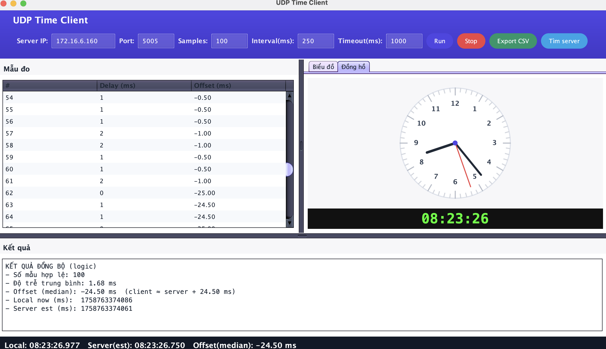
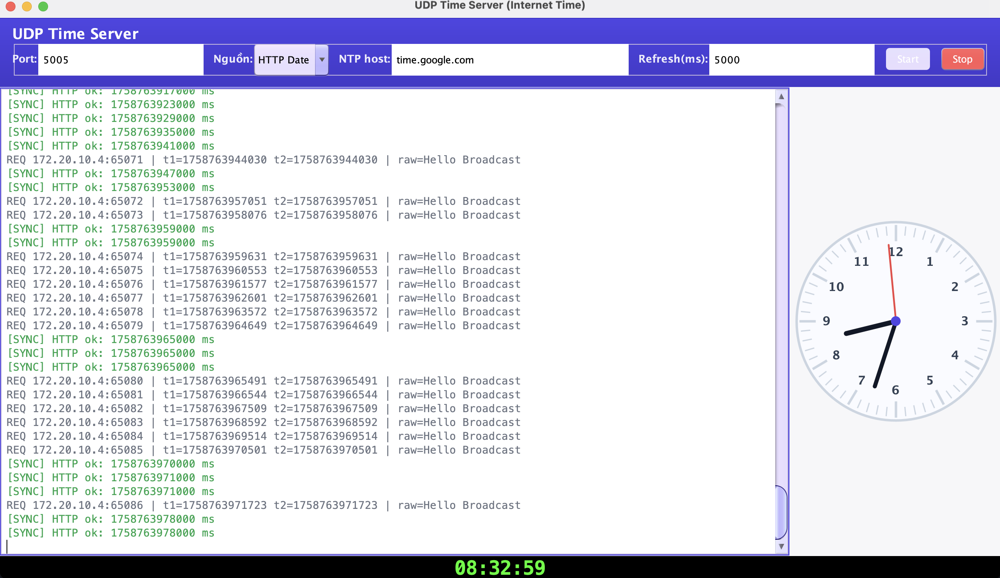
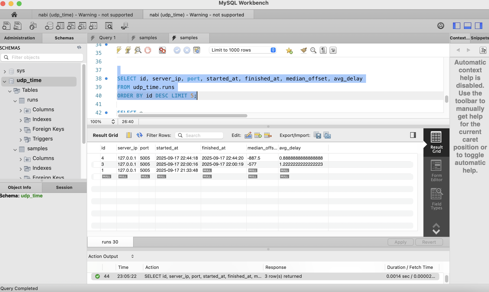
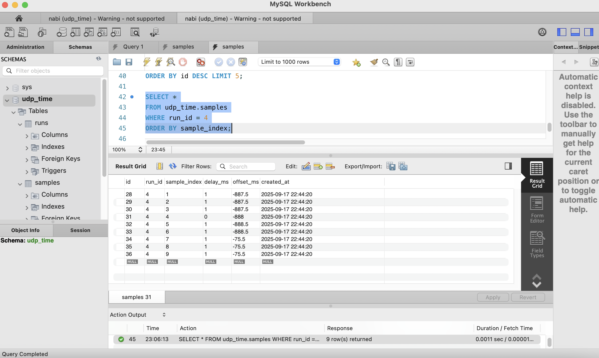
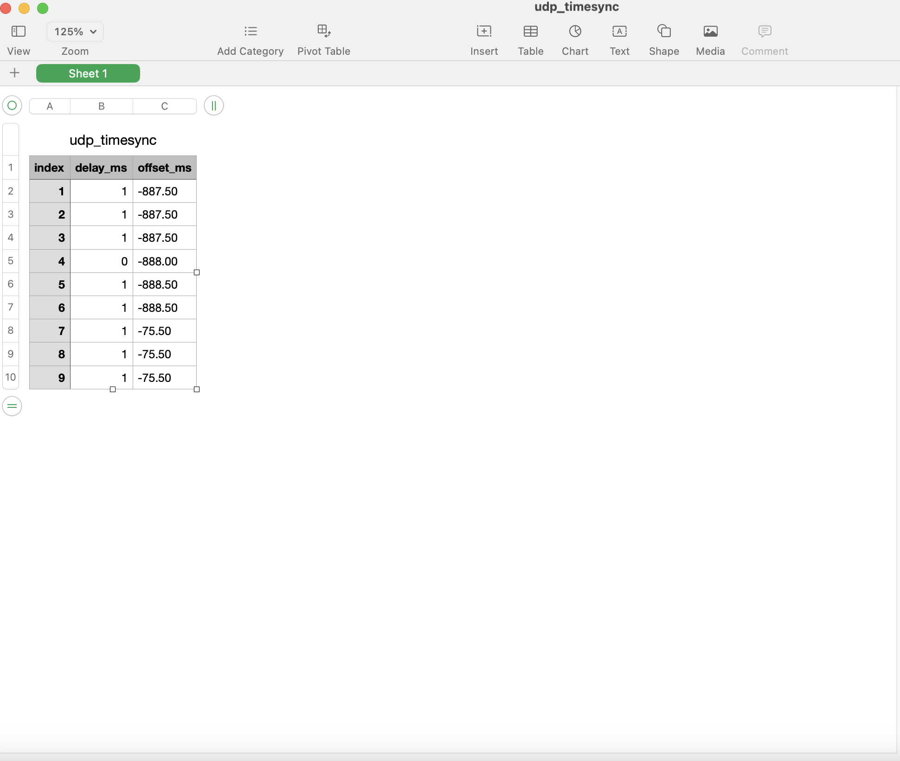

<h2 align="center">
    <a href="https://dainam.edu.vn/vi/khoa-cong-nghe-thong-tin">
    🎓 Faculty of Information Technology (DaiNam University)
    </a>
</h2>
<h2 align="center">
   Đồng hồ Server – Client (đồng bộ thời gian)
</h2>

    

        
        
        
    

## 📖 1. Giới thiệu hệ thống 

Hệ thống đồng bộ thời gian dựa trên giao thức UDP được xây dựng nhằm mục tiêu đảm bảo các máy tính trong mạng nội bộ có thể duy trì sự thống nhất về thời gian. Trong các hệ thống phân tán, sự khác biệt thời gian (time drift) giữa các thiết bị là một vấn đề quan trọng, bởi nó có thể gây sai lệch trong việc:

    📌 Ghi log và phân tích sự kiện (event logging).

    📌 Sắp xếp thứ tự các giao dịch trong hệ thống (ordering transactions).

    📌 Đồng bộ dữ liệu và truyền thông trong mạng (data synchronization & communication).

    📌 Đảm bảo tính toàn vẹn và chính xác của các thuật toán phân tán (distributed algorithms).

👉 Thay vì sử dụng các giao thức phức tạp như NTP (Network Time Protocol) hay các phương thức đồng bộ khác (TCP, RMI), đề tài này lựa chọn UDP vì:

    ⚡ Hiệu năng cao: UDP là giao thức không kết nối, giảm overhead khi truyền gói tin.

    🌍 Hỗ trợ broadcast: cho phép một client tìm server trong cùng mạng LAN nhanh chóng.

    🛠️ Đơn giản, dễ triển khai: phù hợp cho các ứng dụng học tập, mô phỏng và thử nghiệm.

🖥️ Server:

    ⏰ Lấy thời gian chuẩn từ Internet (HTTP hoặc NTP).

    📡 Phản hồi yêu cầu đồng bộ từ client qua UDP.

    🔍 Hỗ trợ broadcast DISCOVER để client tự động tìm server.

    🕒 Hiển thị đồng hồ số và đồng hồ analog.

💻 Client:

    📤 Gửi yêu cầu đồng bộ tới server.

    📋 Hiển thị bảng kết quả (Delay, Offset).

    📈 Vẽ biểu đồ delay/offset.

    🕒 Hiển thị đồng hồ số & đồng hồ analog dựa trên thời gian server.

    💾 Xuất dữ liệu CSV và lưu kết quả vào MySQL để phân tích.

🔹 Ý nghĩa ứng dụng:

    Hệ thống này mô phỏng một bài toán đồng bộ thời gian trong mạng phân tán, giúp sinh viên và nhà nghiên cứu:

    Hiểu rõ hơn về cơ chế đồng bộ thời gian.

    Thực hành triển khai UDP Socket trong Java.

    Rèn luyện kỹ năng thiết kế giao diện trực quan và lưu trữ dữ liệu vào cơ sở dữ liệu.

    Làm nền tảng để mở rộng thành các hệ thống đồng bộ thời gian phức tạp hơn (ví dụ: triển khai NTP thu gọn, đồng bộ trong hệ thống IoT, SCADA, Blockchain...).

## 2. Công nghệ sử dụng

 
 
 
 
 
 
 
 
 
 

## 3. Một số hình ảnh của hệ thống
 
🖥️ Giao diện Client

🖥️ Giao diện Server

📊 Bảng dữ liệu trong MySQL (runs)

📊 Bảng dữ liệu trong MySQL (samples)

📂 Xuất file CSV

## 4. Các bước cài đặt
🔧 Bước 1. Chuẩn bị môi trường

    Cài đặt JDK 8 hoặc 11 ☕.

    Cài đặt MySQL 8.x + Workbench 🗄️.

    Tạo database udp_time
🗄️ Bước 2. Tạo bảng trong MySQL

📦 Bước 3. Thêm thư viện JDBC

    Tải mysql-connector-j-8.x.x.jar.

    Copy vào thư mục lib/ của project → Add to Build Path.
⚙️ Bước 4. Cấu hình kết nối

    Trong DbHelper.java:

    public class DbHelper {
        private static final String URL = "jdbc:mysql://localhost:3306/udp_time";
        private static final String USER = "root";
        private static final String PASS = "your_password";

        public static Connection open() throws Exception {
            return DriverManager.getConnection(URL, USER, PASS);
        }
    }

▶️ Bước 5. Chạy hệ thống

    Chạy TimeServerGUI.java → nhấn Start Server 🟢.

    Chạy TimeClientGUI.java → nhập IP Server → nhấn Run 🚀.

    Quan sát Bảng kết quả, Biểu đồ, Đồng hồ.

    Kiểm tra dữ liệu trong MySQL Workbench:

        SELECT * FROM runs ORDER BY id DESC;
        SELECT * FROM samples WHERE run_id = <id>;
## 5. Liên hệ(cá nhân)

Contact me:

    Nguyễn Thuý Hằng CNTT 16-04

    Khoa: Công nghệ thông tin - Trường Đại học Đại Nam 

    email: nguyenthuyhang.qc2004@gmail.com

    
